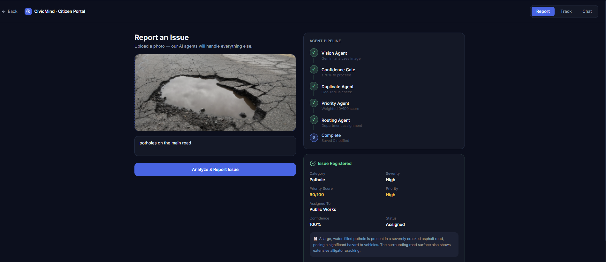

# CivicMind AI 🏙️
**AI-Powered Hyperlocal Civic Governance Platform**

> An autonomous multi-agent platform that detects, validates, prioritizes, routes, and monitors civic issues in real time.

---
## 📸 Demo




## Architecture

```
Citizen Upload
      │
  FastAPI API
      │
Agent Orchestrator
      │
Shared Issue State
      │
 Vision Agent (Gemini Vision)
      │
 Confidence Gate (< 70% → Community Validation)
      │
 Duplicate Agent (Haversine geo-check)
      │
 Priority Agent (Weighted scoring 0-100)
      │
 Routing Agent (Auto department assignment)
      │
  Firestore / In-Memory DB
     / \
Citizen  Mayor
  App   Dashboard
     \ /
  Chat Agent (Gemini)
```

## Agents

| Agent | Purpose |
|-------|---------|
| Vision Agent | Gemini Vision — classifies category, severity, confidence |
| Duplicate Agent | Geo-based check within 100m radius |
| Priority Agent | Weighted score (0-100) based on severity, location, votes |
| Routing Agent | Auto-assigns department based on category |
| Chat Agent | Citizen + Mayor NL queries via Gemini |

---

## Quick Start

```bash
cd backend
cp .env.example .env
# Fill in your API keys

pip install -r requirements.txt
python main.py
```

API runs at `http://localhost:8000`
Docs at `http://localhost:8000/docs`

---

## Key Endpoints

| Method | Endpoint | Purpose |
|--------|----------|---------|
| POST | `/api/report` | Submit issue with image |
| GET | `/api/issues` | List all issues |
| GET | `/api/issues/{id}` | Get single issue |
| PUT | `/api/issues/{id}/status` | Update status |
| POST | `/api/issues/{id}/vote` | Community vote |
| POST | `/api/chat` | Citizen AI chat |
| POST | `/api/mayor/query` | Mayor NL query |
| GET | `/api/dashboard/stats` | Dashboard stats |

---

## Google Technologies Used

- **Gemini 2.5 Flash** — Vision analysis + Chat + Mayor NL queries
- **Google Maps API** — Location, geocoding, map display
- **Firebase Auth** — User authentication
- **Firestore** — Issue database
- **Cloud Storage** — Image storage
- **Cloud Run** — Deployment

---

## Demo Story

*"A citizen spots a pothole outside a school. They upload a photo via the app.*
*The Vision Agent identifies it as a pothole with 96% confidence.*
*The Duplicate Agent confirms it hasn't been reported before.*
*The Priority Agent scores it 87/100 — Critical — because it's near a school.*
*The Routing Agent assigns it to the Public Works Department.*
*The Mayor Dashboard immediately shows the new hotspot on the city map.*
*The citizen asks the AI: 'When will this be fixed?' — and gets an instant, informed reply."*
